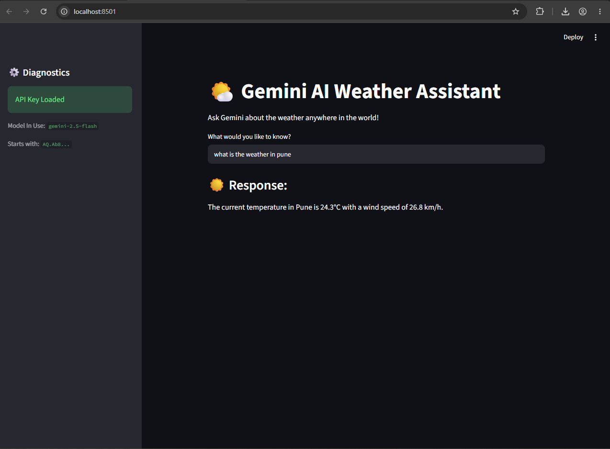
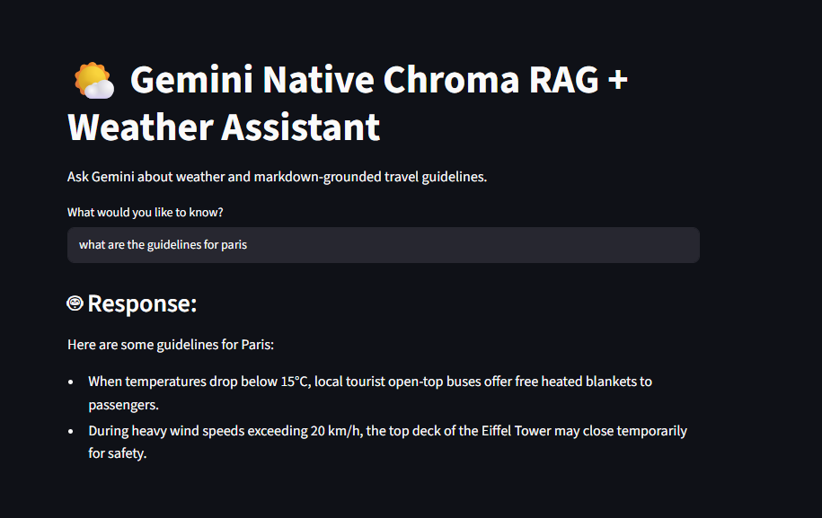
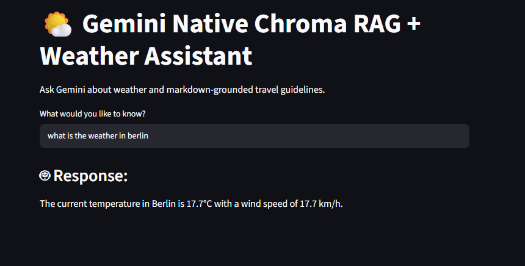
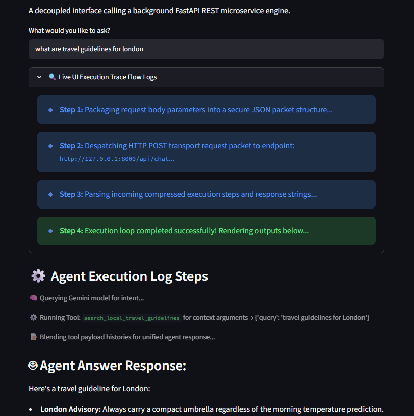
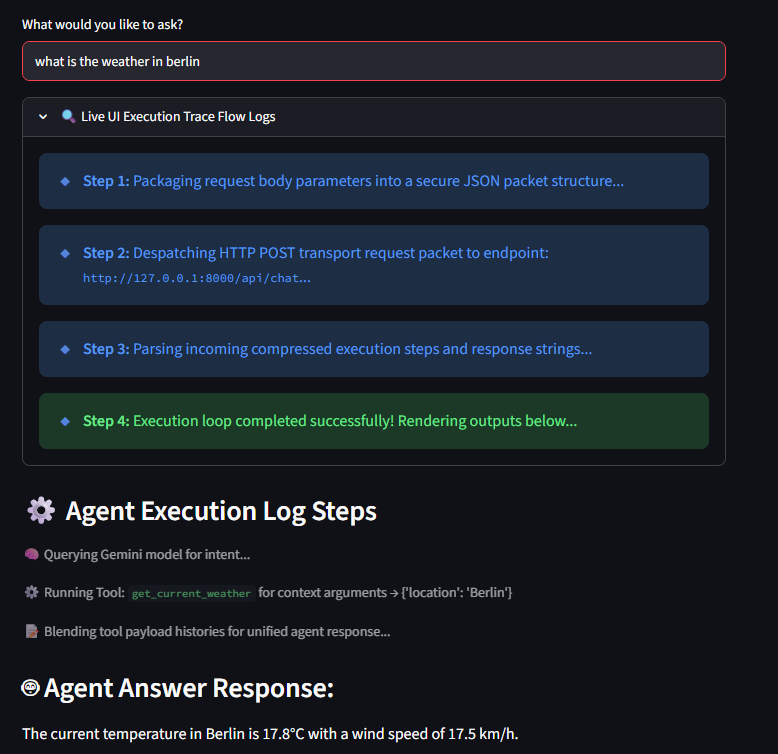

## Project architecture - RAG+VectorDB+LLM
# The agent ui calls rest apis for the agent
# Run the server 
```
 uvicorn agent:app --reload --port 8000
```
# Run the chat bot ui app
```
streamlit run agent-ui.py 
```

## Model to call the tool apis
# Run the weather bot
```
streamlit run weather.py
```
# Ask the bot 
```
 what is the weather in pune
```
# Response should be like 


# Ask the weather bot (RAG + Vector DB + Tool APIs)
## Flow -> If the Gemini LLM can find relevant info in the knowledgebase, return it back to the user
## Else , make the tool call that will get weather info.
## Ask for guidelines for Paris travel and it will find it out from the existing knowledge base
## Ask for the weather in paris, it will make tool call, that will make the weather api call to get weather info
## Run the bot 
```
 streamlit run weather_rag_vectordb
```
```
What are the guidelines for Paris 
```


```
What is the weather in berlin 
```


# BOT exposed on REST API and UI on another app
## Run the bot
```
python .\weather_rag_vectordb_rest_api.py 
```
## Run the ui
```
streamlit run weather_rag_vectordb_ui.py
```


